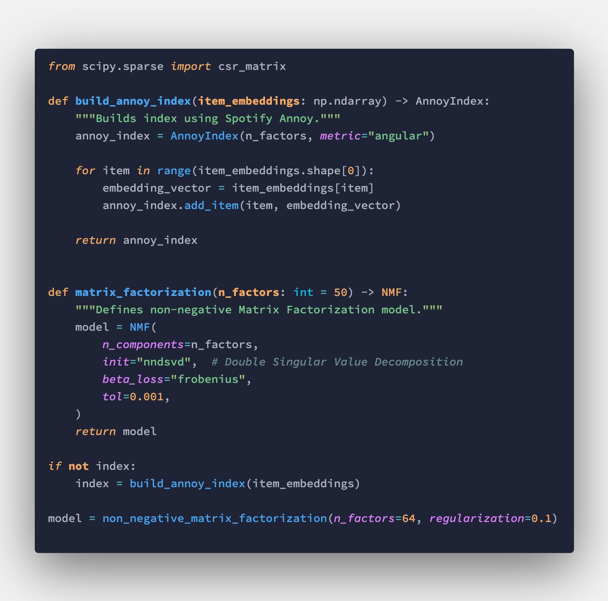

# Tokyo Night Pro
A customized mixture of One Dark Pro and Tokyo Night



For an even cleaner interface I recommend these settings in your `settings.json`.

```json
    "breadcrumbs.enabled": false,
    "editor.renderControlCharacters": false,
    "editor.minimap.showSlider": "always",
    "editor.scrollbar.horizontal": "hidden",
    "editor.scrollbar.vertical": "hidden",
    "editor.overviewRulerBorder": false,
    "editor.scrollbar.verticalScrollbarSize": 0,
    "workbench.tree.renderIndentGuides": "always",
```
